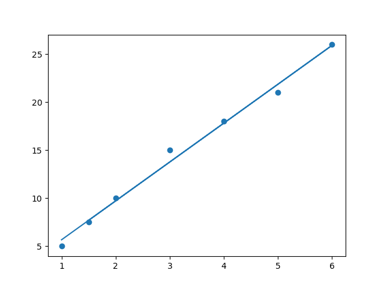

# Modelo de Regressão Linear - Previsão de Notas

Este projeto utiliza **Machine Learning** para prever o desempenho académico de alunos com base nas horas de estudo, aplicando conceitos de inteligência artificial para análise preditiva.

## 🛠️ Tecnologias e Bibliotecas
- **Python**: Linguagem principal.
- **Pandas**: Manipulação e leitura dos dados estruturados (`dados.csv`).
- **Scikit-learn**: Utilizada para implementar o algoritmo de **Regressão Linear** e treinar o modelo preditivo.
- **Matplotlib**: Geração do gráfico para visualização da linha de tendência.

## 📊 Resultado do Modelo
O gráfico abaixo demonstra a correlação positiva entre o tempo de estudo e a nota obtida, com a linha de regressão cruzando os pontos de dados reais:

---
*Exercício prático realizado durante o bootcamp da Generation Brasil.*
